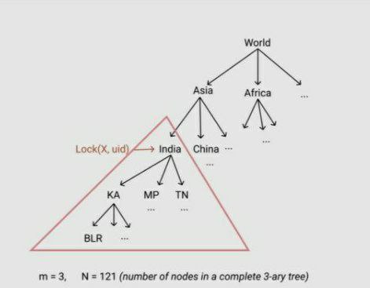

# Tree of Space

You are given a complete, balanced N-Ary Tree and must support Q queries. There are 3 kinds of queries. Return true or false depending on whether the query was successful.

1. **Lock(v, id):** Lock vertex v for user - id
2. **Unlock(v, id):** If vertex v is locked by the same id, unlock it.
3. **Upgrade(v, id):** If v is unlocked and has at least one locked vertex in it's subtree and every locked vertex in the subtree of v is locked by id, unlock them and lock v instead.
Further, here are some additional constraints

A vertex cannot be locked if it has any locked ancestors or descendants, by any ID.
When a vertex is upgraded, it's locked descendants are automatically unlocked.
An upgrade operation is not possible if the vertex is already locked or has any locked ancestors
An unlock operation is only possible if the vertex is already locked and locked by the same id

## Input

* **N :** Number of Nodes
* **K :** Max Number of Children per Node
* **Q :** Number of Queries
* **Arr :** Names of Nodes
* **V :** Type of Query to be performed
* **S :** Name of Node to perform Query on
* **ID :** ID of user that is performing the Query

## Structure of a Tree Node

* **Is Locked :** Boolean, stores whether current node is locked or not
* **ID :** Integer, stores the User ID that has locked the node
* **Parent :** Node, stores reference to the parent node from the current node
* **Ancestors Locked :** Integer, stores number of ancestors of the current node that are locked
* **Descendents Locked :** Integer, stores number of descendents of the current node that are locked
* **Children :** ArrayList, stores all the children of the current node
